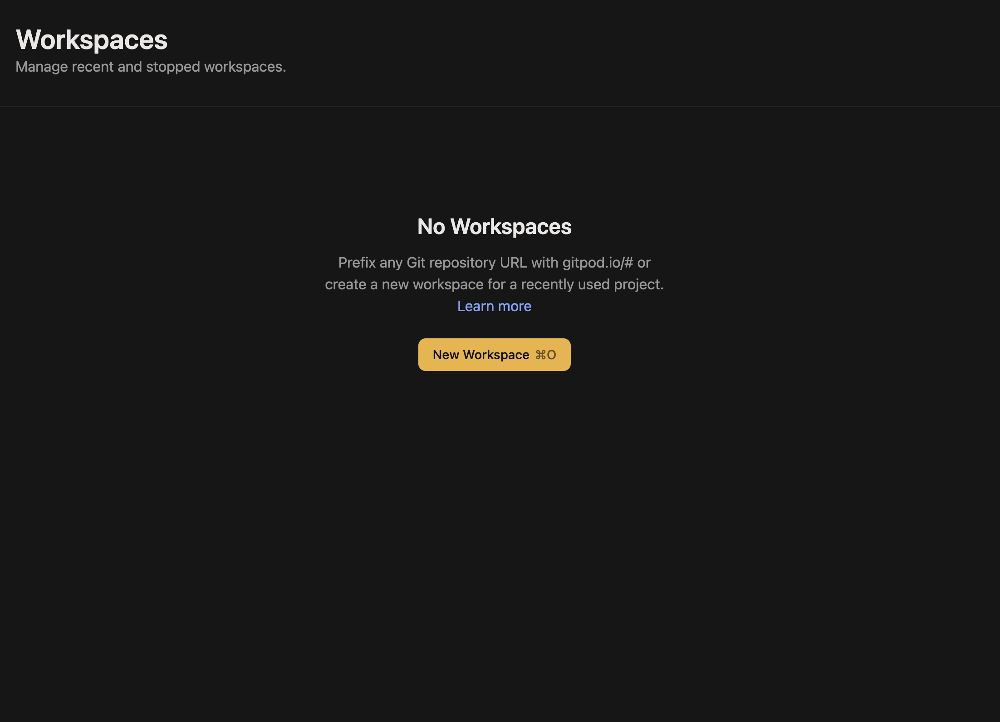
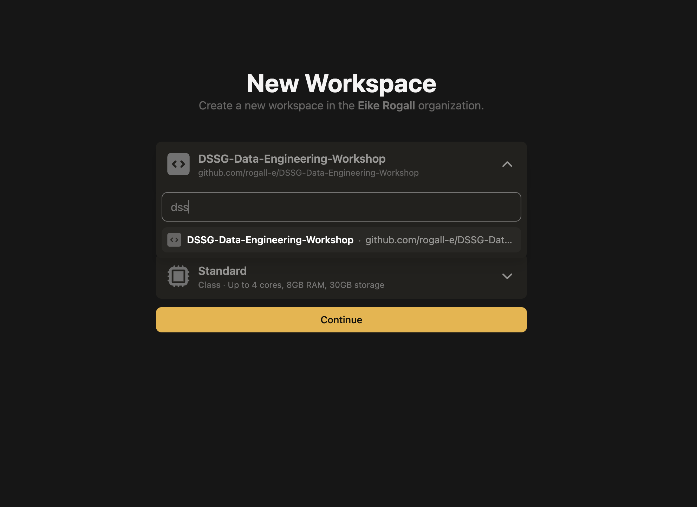

# Developer Setup - 15min

## The Repo

## Gitpod Setup

### What is Gitpod?
Gitpod is a cloud-based IDE that allows you to develop software in your browser. It is based on [Theia](https://theia-ide.org/) and [VS Code](https://code.visualstudio.com/). Gitpod has an [open source program](https://www.gitpod.io/discover/opensource) that offers 2,500 credits per month of free CDE usage but it also offers a free plan for private projects. Gitpod is a great tool for workshops and tutorials as it allows you to start with a pre-configured environment in your browser. This saves you the time to install and configure all the tools on your local machine.

### Create a Gitpod Account
To create a Gitpod account, go to [gitpod.io](https://gitpod.io) and click on the "Sign Up" button in the top right corner. You can sign up with your GitHub, BitBucket or your GitLab account. The free plan is sufficient for this tutorial.

### Fork the Repo
To fork the repo, click on the "Fork" button in the top right corner of the [repo](https://github.com/rogall-e/DSSG-Data-Engineering-Workshop). This will create a copy of the repo in your GitHub account.

### Open the Repo in Gitpod
To open the repo in Gitpod, go to [Gitpod.io](https://gitpod.io/workspaces) and click on the "New Workspace" button. 

Here you can choose now repos that you can use in Gitpod.

This will take a few minutes. Once the workspace is ready, you will see the following screen:

Automatically Gitpod will set everything up for you. This will take a few minutes. Based on the .gitpod.yml file, Gitpod will install all the tools that are needed for this workshop. 

To stop the workspace, you can click on the "Menu" button in the top right corner. And in this menu you will `Gitpod: Stop Workspace`. This will stop the workspace from running but you can continue later where you left off with simply starting it again.

## Optional: Docker and Docker-compose

For running this workshop locally, you need Docker, Docker-compose and a python environment. If you don't have Docker and Docker-compose installed, you can follow the instructions [here](https://docs.docker.com/get-docker/) and [here](https://docs.docker.com/compose/install/).

## Getting Started
You need to fork the repo, click on the "Fork" button in the top right corner of the [repo](https://github.com/rogall-e/DSSG-Data-Engineering-Workshop). This will create a copy of the repo in your GitHub account. And afterwards clone the repo.

### Setup Python Environment
To setup the python environment you can use the provided requirements.txt file or poetry. 

### Setup Docker
To setup Docker, you can use the provided docker-compose.yaml file. Simply run `docker-compose up -d` in the root directory of the repo. 

This will start: 
- A Postgres Database 
- An Airbyte Server which you can access on http://localhost:8000 
- A metabase instance which you can access on http://localhost:3000

