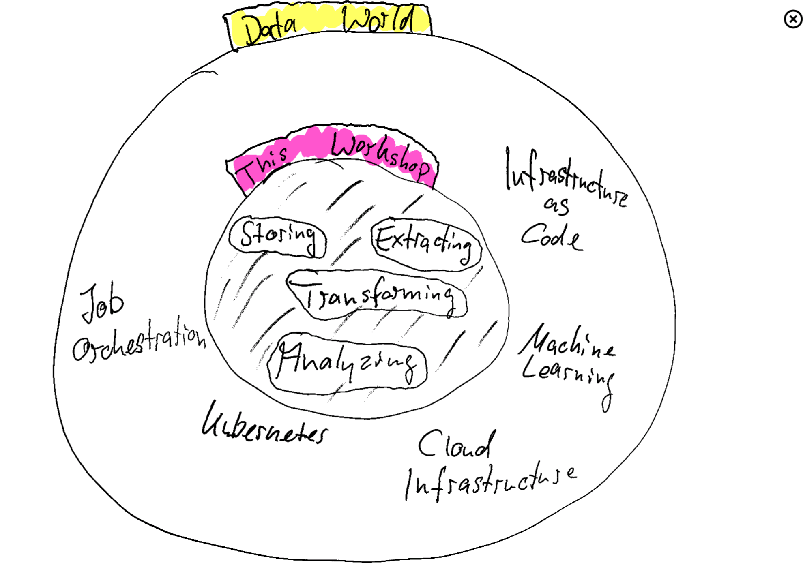

# Expectations

<!--   -->
 

---
## We are learning to:
- Set up a basic Analytical Database using DuckDB
- Read some data from various sources into our database with Airbyte
- Transform the data into a unified view with dbt
- Attach a visualization tool to the database using Metabase

## We are **not** touching:
- Buildig a production-ready data pipeline.
- Setting up cloud infrastructure
- Orchestrating complext data pipelines with lots of dependencies
- Interacting with all the bells and whistles of the tools we will use. 

