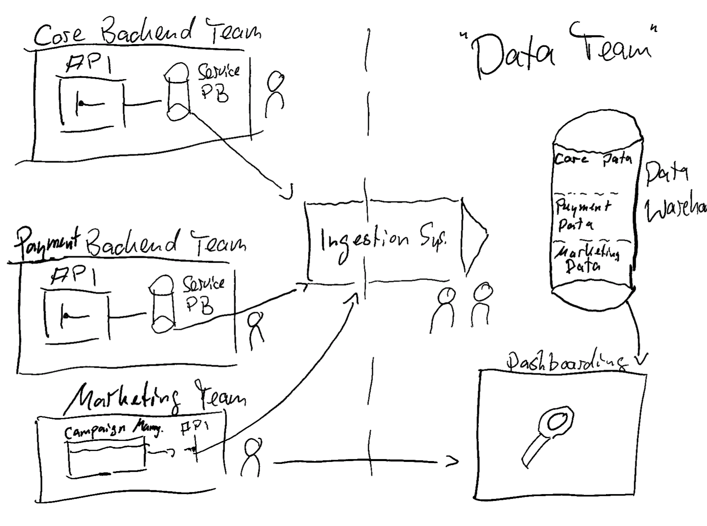
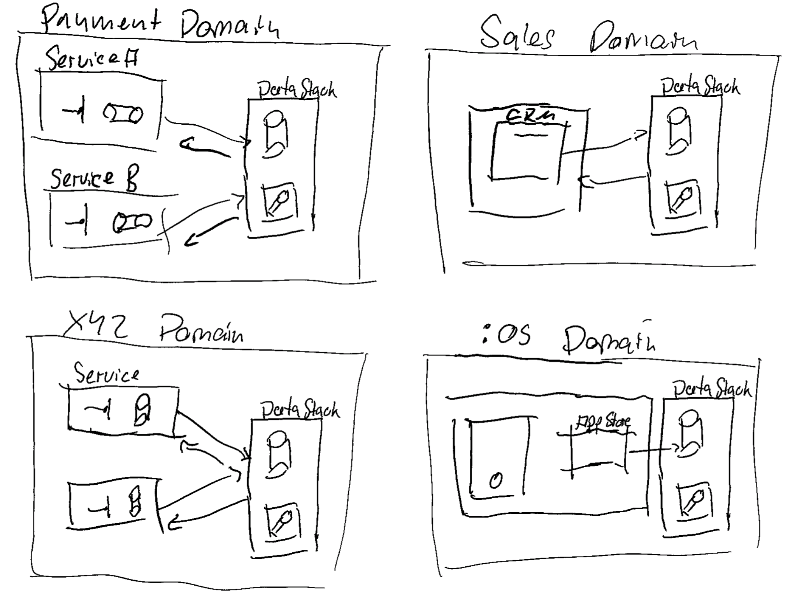

# The Evolution of Data Orgs

!!! note "Disclaimer"
    
    I am sketching a totally artificial and simplified evolution of differen stages of  data in organisations. The goal is to show the different phases of data engineering and the different challenges that come with it.

=== "Small Orgs - No Data Person"
    - Analytical needs are solved via direct communication
    - Data is stored in a decentralized fashion, mostly in spreadsheets

    

=== "Small Orgs - One Data Person"
    - Identified need for bringing data together and analyzing aggregates of it
    - One centralized storage is set up
    - Data is exported manually and imported into a central storage. Often still file based.
    - The standardization is often driven from the cost side (e.g. Analyzing Marketing)

    

=== "Small/Mid Tech Orgs"
    - Tech Teams having their own databases to fullfill operations
    - Data is already structured and can be retrieved from databases or APIs

    

=== "Decentralized Tech Orgs"
    - Multiple Tech and Non Tech Domains having different data needs
    - Data is not used for analytical purposes only.
    - Products are build on top of data. Circular dependency between data and product.
    - Teams own their own data pipelines and storage.

    
