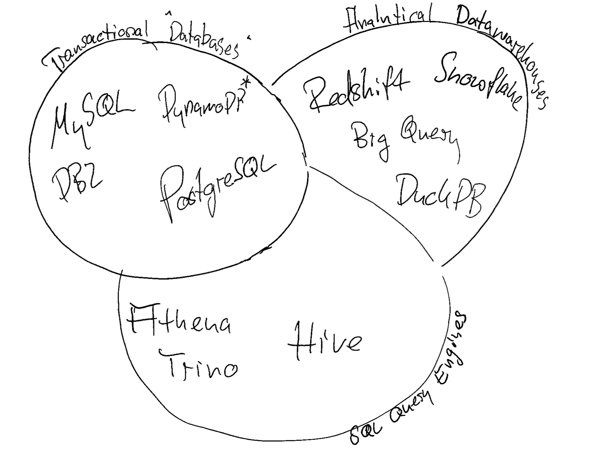

# Database Systems, Warehouses and Data Lakes

There are tons of tools out there that enable you to store and query data. Most tasks can be done with all of the solutions, which does not mean that it should be without consideration. Some things to take into account are:

- **Transactional Databases**: These are databases that are optimized for fast read and write operations and espcially consistency (ACID). They are usually used to store data that is used Backend Systems. Examples are Postgres, MySQL or DynamoDB (NoSQL).
- **Analytical Databases**: These are databases that are optimized for fast read operations. They are usually used to store data that is used for analysis. Examples are Redshift, BigQuery, Snowflake, or DuckDB.
- **Data Lakes**: Data lakes with Query Engines on top are usually used to store file based data that is then queried via SQL. They are not databases in the original sense but just provide an Query interface on top. They tend to give less guarantees when it comes to write consitency. Examples are S3, GCS, or HDFS with Presto, Hive, or Spark on top.

Today we will focus on one data storing solution that we hope is a good start into data warehousing **without the technical overhead**: [DuckDB](https://duckdb.org/).
## Popular Data Storage Solutions

 

