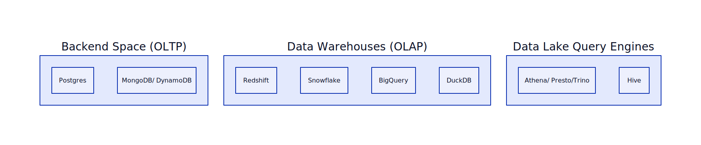

# Storing Data

As you might imagine, storing data in key in data disciplines, so there is no way around this today. You can store data in tons of ways and we do not need to explain you all as you are most likely familiar with lots of them.

## Popular Data Storage Solutions

<!--   -->
<!---->
<!-- - Big Query -->
<!-- - Athena -->
<!-- - Snowflake -->
<!---->
<!-- Databases used for backend systems: -->
<!-- - Postgres -->
<!-- - MongoDB/ DynamoDB -->
<!---->
<!-- Some solutions store data in the database itself, some use filesystems like s3 or GCS.  -->
<!-- Most systems have a SQL interface to query the data. -->

Today we will focus on one data storing solution that we hope is a good start into data warehousing **without the technical overhead**: [DuckDB](https://duckdb.org/).

