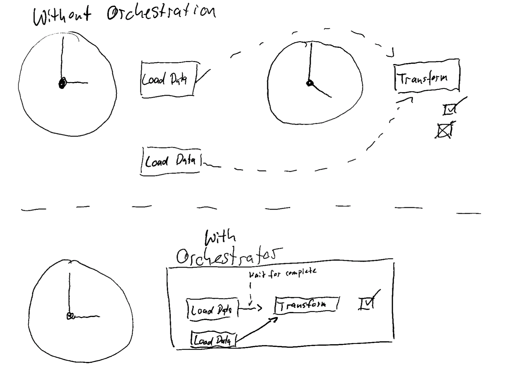

# Connections, Jobs and Scheduling ⏰

Most propably you do not want to get up every night at 3am to start your data ingestion. Luckily you do not have to!
There are basically two ways to schedule your data ingestion:

1. Scheduling the steps **just based on time** (e.g. using cron). Problem: The different steps have no idea about each other.
1. Using an **Orchestrator** like Airflow or Prefect. Problem: You need to setup and maintain an orchestrator which can be quite complex in the beginning.

!!! tip
    If you are just getting started, you can use the first approach. Your jobs will not have many dependencies and most of the time everything will work. Most tools like Airbyte come with basic scheduling. If you want to build a production-ready data pipeline, you should use an orchestrator.

