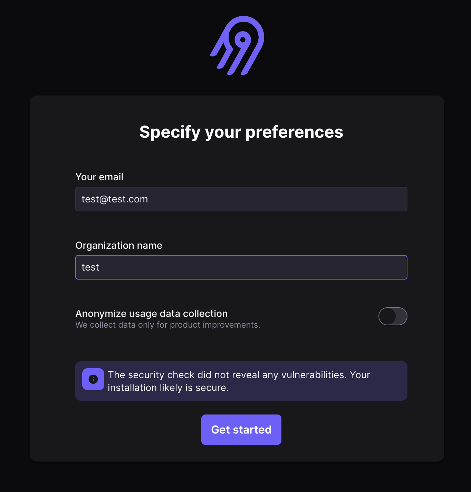
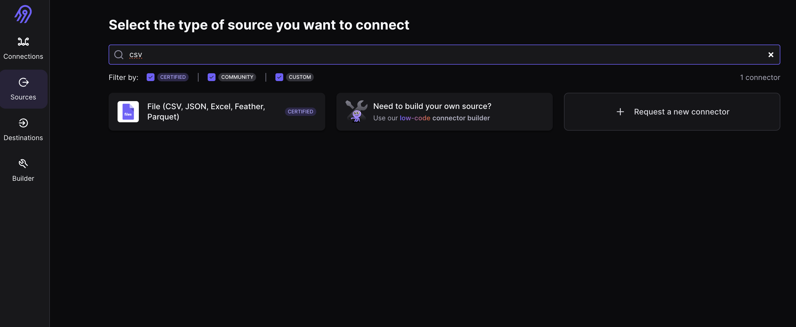
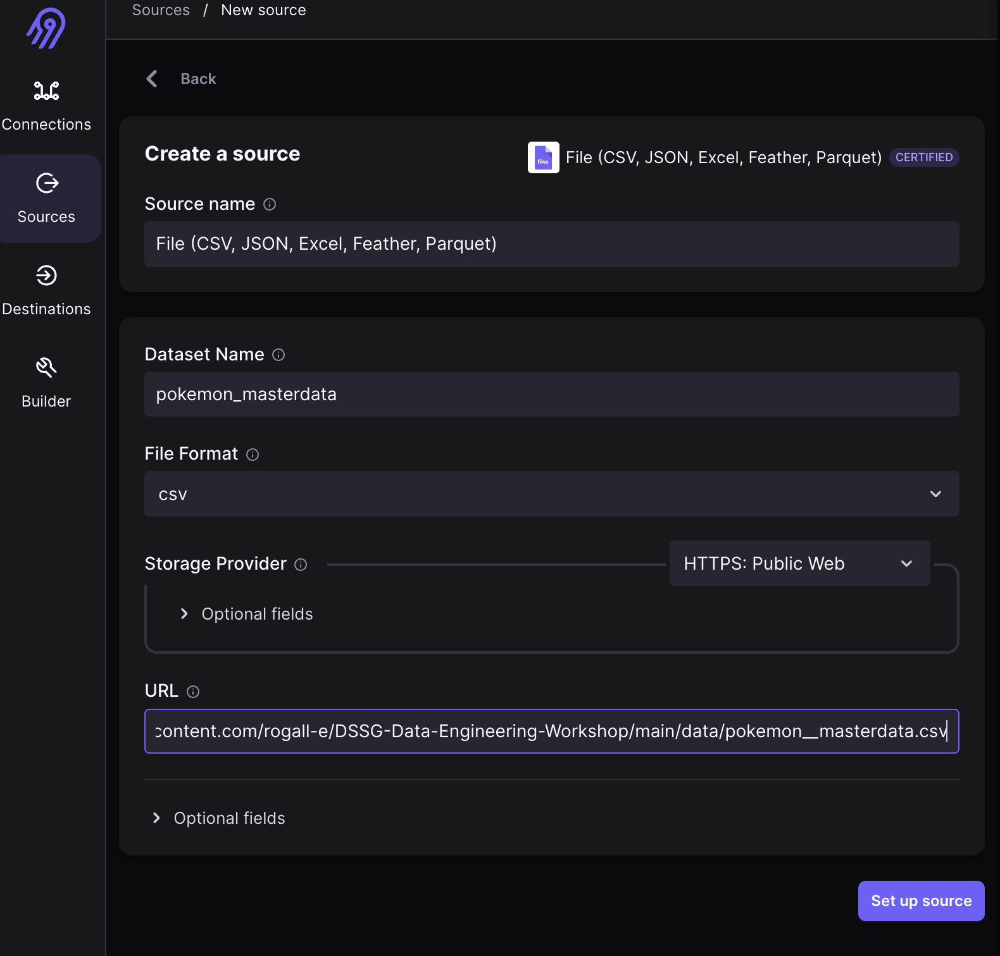
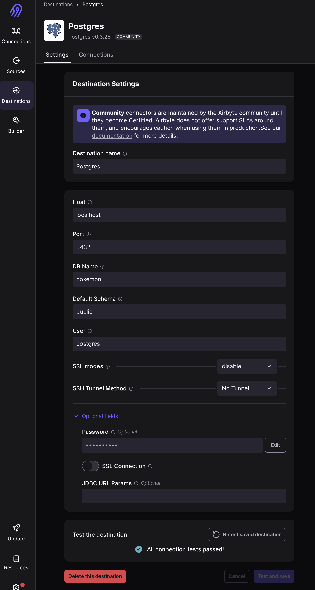

# Extracting and Loading Data

Extracting and loading data is the process of getting data from a source and loading it into a target. The source can be a file, a database, an API, or any other source of data. The target can be a file, a database, or any other target that can store data.


## Concepts

### Sources

### Destinations

### Jobs

## The Lifecylce of a data organisation
What needs occur in the lifecycle of a data organisation? What are the main challenges that occur in each of these phases? How can we solve them?


### Examples from a 5 person company
### Examples from a 500 person company


## Why you should not build things yourself


## Airbyte Intro

We will use Airbyte for the extraction and loading of data. Airbyte is an open-source data integration platform that helps you consolidate data from different sources and load it into a destination of your choice. It can be either self-hosted on your own infrastructure or you can use their cloud version. 

Airbyte follows a modular approach. It has a core platform that handles the orchestration of the data integration process and a set of connectors that handle the extraction and loading of data from different sources and to different destinations.

If you are using Gitpod you can go to the `port` section of the terminal and click on the `Open Browser` button. This will open a new browser tab with the Airbyte UI. If you are running the tutorial locally you can go to `http://localhost:8000` to access the Airbyte UI after you started the docker containers.

If you go to the UI it asks for a username and password. You can use `airbyte` as username and `password` as password. Afterwards you have to enter an email address and an organization name. You can use any email address and organization name you want (even test@test.com and test)




### Setting up the Airbyte Source

In our case we will connect two csv files as sources that are stored on github. But it would work similarly with any other data storages like for example an S3 bucket on AWS.

To set up an source in airbyte click on the `Sources` tab and then on the `New Source` button. You will see a lot of connectors and a serach bar. Here you can look for `csv`. 



Click on the `File` connector and you will see a form where you can enter the details for the source. Enter the following details:

```
Dataset Name: pokemon__masterdata
File Format: CSV
URL: https://raw.githubusercontent.com/rogall-e/DSSG-Data-Engineering-Workshop/main/data/pokemon__masterdata.csv
```

(of course you can also take the link from your forked repository if you want to use your own data)



Afterwards click on the `Set up source` button to create the source.


### Setting up the Airbyte Destination

As a destination we will use a Postgres database that was started in gitpod automatically for you or you started with the docker compose command locally. You can access the database with the following credentials:

```
host: localhost
port: 5432
database: pokemon
user: postgres
password: password
```

In Airbyte click on the `Destinations` tab and then on the `Create Destination` button. Select `Postgres` as destination and enter the credentials for the database (the password is under `Optional fields`). Afterwards click on the `Set up destination` button to create the destination.



### Setting up the Airbyte Connection

Now we have to connect the source and the destination. Click on the `Connections` tab and then on the `Create Connection` button. Select the source 


and the destination 


you created before. Afterwards you get to the connection configuration page. Here you can select a schedule, a destination namespace and a prefix for the stream also you can choose the streams you want to sync and if your data should be normalized by airbyte or only the raw data should be loaded into the destination. In our case we will set our schedule type to manual so we have to trigger the sync by hand. Afterwards click on the `Set up connection` button to create the connection.


And now you can click on the `Sync Now` button to start the sync. You can see the progress/log of the sync in the `Job History` tab.


Now you have successfully extracted and loaded data from a source to a destination. 