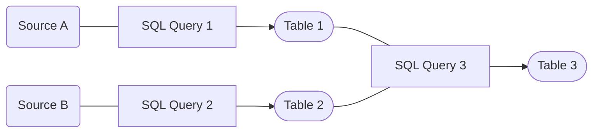

## How to get create Metrics from Raw Data?

To create such KPIs, we need to **transform** our raw data into something more meaningful.

A typical workflow might look like this:

 

 

Transformation can be anything (*Aggregations, Joins, Calculations, etc.*) and can also be executed in many different ways. 

How the logic of a transformation is done, depends on the use case, your business questions and requirements.

One of the preferred ways of encoding transformation logic in the data world is **SQL**. 

As mentioned before, SQL is a very powerful and easy to learn language. So it makes sense to also use it for our transformations.

Typically, we would write different SQL statements with different kind of transformations and execute them in the correct order:

 

 

In this example, we have two different sources, which we first want to transform (e.g. do some cleaning or filtering) and then join into a new table.

As you can imagine, this can get quite complex and hard to maintain. Especially if you have many different sources and transformations.

But worry no longer, there is a solution for this problem: **[DBT](https://www.getdbt.com/)**