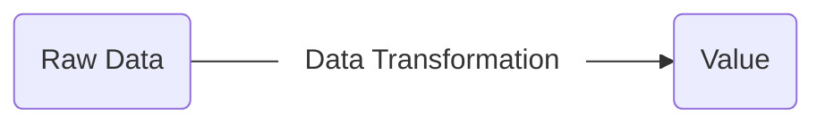

# Transform Raw Data into something meaningful

While it's nice to have some raw data in place, in its current state, it won't help us to create insights and answer our most burning questions:

- `How many Pokemon donated?`
- `How much money did we collect in total?`
- `What was the average donation per Pokemon?`

To answer these questions, we need to *crunch* our data first and make it more useable for anaylsis. 

This might involve:

1. *Cleaning*
2. *Joining*
3. *Aggregating*

While "*crunching*" is a pretty cool word, a bit more suitable (and that's the topic of this section) might be: **Data Transformation** 

 

 

!!! Note "Data Transformation is the key to create value from raw data!"