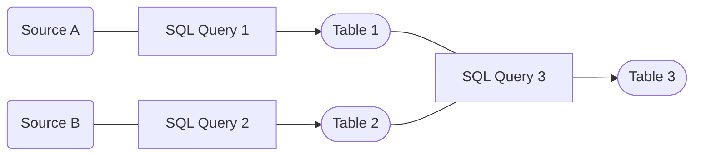

# Transformation

While it's nice to have some raw data in place, in its current state, it won't help us to answer our most burning questions.

So **how can we create business value** from our raw data and generate shiny **KPIs** (Key Performance Indicators), clean **metrics** and powerful **insights**?


## Let's start at the end

To answer this question, it might make sense to step some steps forward and start at the end. What do we want to achieve? What do we want to have in the end?

Most of the time, we aim to create a key indicator or a metric (*the naming here is a discussion on its own*), that helps us to answer a business question. 

Here are some examples:

- `Number of Pokemon, which donated in December`
- `Total amount of donations in December`
- `Average amount of donation per Pokemon`

### How to get create Metrics from Raw Data?

To create such KPIs, we need to **transform** our raw data into something more meaningful.

A typical workflow might look like this:

<br />
<div style="text-align: center;">

</div>
<br />

Transformation can be anything (*Aggregations, Joins, Calculations, etc.*) and can also be executed in many different ways. 

How the logic of a transformation is done, depends on the use case, your business questions and requirements.

One of the preferred ways of encoding transformation logic in the data world is **SQL**. 

As mentioned before, SQL is a very powerful and easy to learn language. So it makes sense to also use it for our transformations.

Typically, we would write different SQL statements with different kind of transformations and execute them in the correct order:

<br />
<div style="text-align: center;">

</div>
<br />

In this example, we have two different sources, which we first want to transform (e.g. do some cleaning or filtering) and then join into a new table.

As you can imagine, this can get quite complex and hard to maintain. Especially if you have many different sources and transformations.

But worry no longer, there is a solution for this problem: **[DBT](https://www.getdbt.com/)**

## DBT - Data Build Tool

**[DBT](https://www.getdbt.com/)** is a tool, which helps us to manage our data transformation logic. 

Using dbt is at easy as writing some SQL statements and running them in the correct order with only **one command**. DBT will then take care of the rest.

Next to executing SQL in the correct order, DBT also has some other nice features. Some examples:

- DBT has knowledge of your data **lineage**
- DBT can **test** your data
- DBT helps with writing **documention** on your data
- DBT facilitates the use of the **DRY** principle (*Don't Repeat Yourself*)

### One word on the DRY principle (aka *jinja templating*)

DBT enables the use of *jinja templating*. This means, that you can use variables and loops in your SQL statements.

This is especially useful, if you have to repeat the same logic over and over again.

So instead of writing the same SQL statement multiple times, you can use a variable and loop over it.

Here is an example:

```sql
-- This is a jinja variable
-- -- -- -- -- -- -- -- -- -- -- -- -- -- -- -- -- -- -- -- -- -- -- -- 


-- This is a jinja loop
-- -- -- -- -- -- -- -- -- -- -- -- -- -- -- -- -- -- -- -- -- -- -- -- 
SELECT 
    
        item ,
    
FROM 
    my_schema.my_table

-- This compiles to this:
-- -- -- -- -- -- -- -- -- -- -- -- -- -- -- -- -- -- -- -- -- -- -- -- 
SELECT 
    column_a, 
    column_b, 
    column_c
FROM
    my_schema.my_table
```

You can also store jinja templates as so called **macros** and call them kinda like functions in your SQL statements. 

The most famous use of jinja in DBT is the `ref()` function, which is used to reference other DBT models:

```sql
-- With the ref() function you can reference other DBT models:
-- -- -- -- -- -- -- -- -- -- -- -- -- -- -- -- -- -- -- -- -- -- -- -- 
SELECT 
    *
FROM 
    {{ ref(my_table) }} 

-- This compiles to this:
-- -- -- -- -- -- -- -- -- -- -- -- -- -- -- -- -- -- -- -- -- -- -- -- 
SELECT 
    *
FROM
    my_schema.my_table
```

More on that here: **[DBT Macros](https://docs.getdbt.com/docs/build/jinja-macros)**


## DBT Workflow

To get a full overview of DBTs capabilities, please check out the **[DBT Documentation](https://docs.getdbt.com/docs/introduction)**.

A typical DBT workflow starts with creating some DBT **models** (*= SQL statements*) in your model folder:

``` 
models
├── pokemon__model_a.sql
├── pokemon__model_b.sql
├── pokemon__model_c.sql
└── schema.yml
```

In the `schema.yml` file, you can write some documentation on your models and define tests. For example:

```yaml
version: 2
models:
- name: pokemon__model_a
  description: This table is super nice!
  columns:
    - name: pokemon_id
      desription: Unique identifier for a pokemon.
      tests:
        - unique
        - not_null
```

With this .yaml we are saying, that the column `pokemon_id` in the model `pokemon__model_a` should be unique and not null. 

DBT will then automatically test this for us and throw an error, if the test fails.

After creating your models, you can create your models with the following commands:

```bash
dbt run     # creates all models
dbt test    # runs all tests
dbt build   # runs both commands for each model
```

DBT has now executed all your models in the correct order and created the corresponding tables in your database.