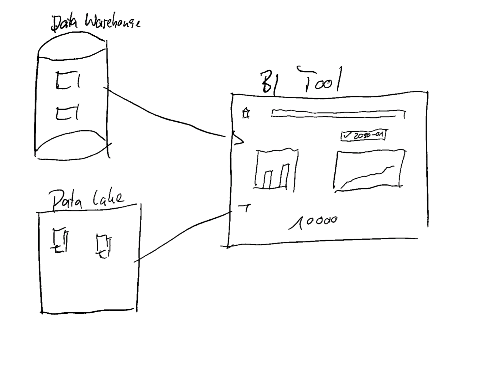

# Analyze - 30min

This is the part where you get to play with the data. We will use a tool called Metabase to explore the data and answer some questions. **This part is not our main focus** as we assume that vizualizing data is not the main challenge for most of you.

- Most Dashboarding tools work quite similar. They are a front end to your Data Warehouse and most of the time come with a lot of connectors to connect to various Data Stores via SQL. 
- They are able to adjust SQL queries dynamically, so you can filter and group your data in various ways. They also cache the data so that frequent queries are executed faster and do not load the same data again and again.
- Companies and people behind those tools want to make money to some extend. While this is totally fine, it is important to understand that this is also the reason why a lot of those tools have so many features while you actually only need a small subset of them. 
- Popular Dashboarding tools are e.g. Metabase, Tableau, Looker, Power BI, Redash, Superset and many more. 

??? tip "What you need most of the time is the functionality to group line and bar charts in a dashboard and apply some dynamic filters on them."
    

